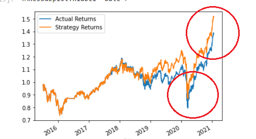

# Unit-14-Homework-Machine-Learning-Trading-Bot

## Challenge
---

In this Challenge, I had to assume the role of a financial advisor at one of the top five financial advisory firms in the world. This  firm constantly competes with the other major firms to manage and automatically trade assets in a highly dynamic environment. In recent years, the firm has heavily profited by using computer algorithms that can buy and sell faster than human traders.
The speed of these transactions gave the firm a competitive advantage early on. But, people still need to specifically program these systems, which limits their ability to adapt to new data. I had plan to improve the existing algorithmic trading systems and maintain the firm’s competitive advantage in the market. To do so, I enhanced the existing trading signals with machine learning algorithms that can adapt to new data.

### `In a Jupyter notebook, I did the following:`

1. Implement an algorithmic trading strategy that uses machine learning to automate the trade decisions.

2. Adjust the input parameters to optimize the trading algorithm.

3. Train a new machine learning model and compare its performance to that of a baseline model.

4. As part of my  GitHub repository’s README.md file, I also created a report that compares the performance of the machine learning models based on the trading predictions that each makes and the resulting cumulative strategy returns.

Instructions
These are the steps for this Challenge divided into the following sections:

1. Establish a Baseline Performance

2. Tune the Baseline Trading Algorithm

3. Evaluate a New Machine Learning Classifier

4. Create an Evaluation Report

## `Establish a Baseline Performance`

- In this section, I had to  run the provided starter code to establish a baseline performance for the trading algorithm. To do so I had to: 
1. Open the Jupyter notebook. 
2. Restart the kernel. 
3. Run the provided cells that correspond with the first three steps, and then proceed to step four.

- I then Imported the OHLCV dataset into a Pandas DataFrame.

- I Generated trading signals using short- and long-window SMA values.

- I split the data into training and testing datasets.

- I used the SVC classifier model from SKLearn's support vector machine (SVM) learning method to fit the training data and make predictions based on the testing data. I then reviewed  the predictions.

- I reviewed the classification report associated with the SVC model predictions.

- I created a predictions DataFrame that contains columns for “Predicted” values, “Actual Returns”, and “Strategy Returns”.

- I created a cumulative return plot that shows the actual returns vs. the strategy returns. I saved a PNG image of this plot. This will serve as a baseline against which to compare the effects of tuning the trading algorithm.

## Tune the Baseline Trading Algorithm
---
#### In this section, I tuned the model’s input features to find the parameters that result in the best trading outcomes. I had to  choose the best by comparing the cumulative products of the strategy returns. To get to this conclusion I had to complete the following steps:

1. Tune the training algorithm by adjusting the size of the training dataset. To do so I sliced the  data into different periods. Reran the notebook with the updated parameters, and recorded the results in my README.md file. I had to answer the following question:
1)  What impact resulted from increasing or decreasing the training window?

## 1 Month

---
## 6 Month 

--- 

## 9 Month

---

### Answer 
1. when I preformed a 1 month DateOffset both my accuracy and 1.0 precision and recall stayed the same but pretty much all other values changed

2. when I preformed a 6 month DateOffset I noticed that my accuracy improved as well as my recall. All other items like macro and weighted also changed

3. when I preformed a 9 month DateOffset My recall decreased as well as my accuracy. 

---

- I then had to tune the trading algorithm by adjusting the SMA input features. I adjusted both of the windows for the algorithm. I reran the notebook with the updated parameters, and recorded the results .
I had to Answer the following question: 
1. What impact resulted from increasing or decreasing either or both of the SMA windows?

## `Short = 2 Long = 100`

--- 
## `Short = 4 Long =100`

---
## `short = 4 Long = 70`

---

## `Short = 5 Long = 20`

---

## `Short = 5 Long = 100`
 

## Answer: 

- When I edited the the short window to 2 but kept the same long window I got more accurate results.
- When I created a shorter Long window my results were less accurate  with lower returns.

---

 The set of parameters that best improved the trading algorithm returns. Save a PNG image of the cumulative product of the actual returns vs. the strategy returns, was `Short window = 4 and Long window = 100`

## Evaluate a New Machine Learning Classifier
In this section, I used the original parameters that the starter code provided. I applied them to the performance of a second machine learning model. In order to do so I had to complete the following steps:

1. I had to import a new classifier.

2. I used the original training data as the baseline model, I fit another model with the new classifier.

I then backtest the new model to evaluate its performance.

Question: Did this new model perform better or worse than the provided baseline model? Did this new model perform better or worse than your tuned trading algorithm?

## Answer : this new model did a little better than the provided baseline model and about the same as my tuned algorithm  

